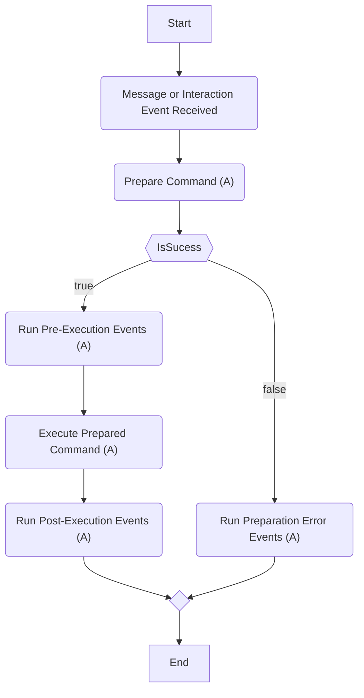

```mermaid
flowchart TB
    Start[Start] --> EventReceived(Message or Interaction Event Received)
    EventReceived --> PrepareCommand("Prepare Command (A)")
    PrepareCommand --> IsSuccess{{IsSucess}}
    IsSuccess -->|true| RunPreExecEvents("Run Pre-Execution Events (A)")
        RunPreExecEvents --> ExecPrepCommand("Execute Prepared Command (A)")
        ExecPrepCommand --> RunPostExecEvents("Run Post-Execution Events (A)")
    IsSuccess -->|false| RunPrepErrorEvents("Run Preparation Error Events (A)")
    RunPostExecEvents --> X{<s></s>}
    RunPrepErrorEvents --> X
    X --> End[End]
```